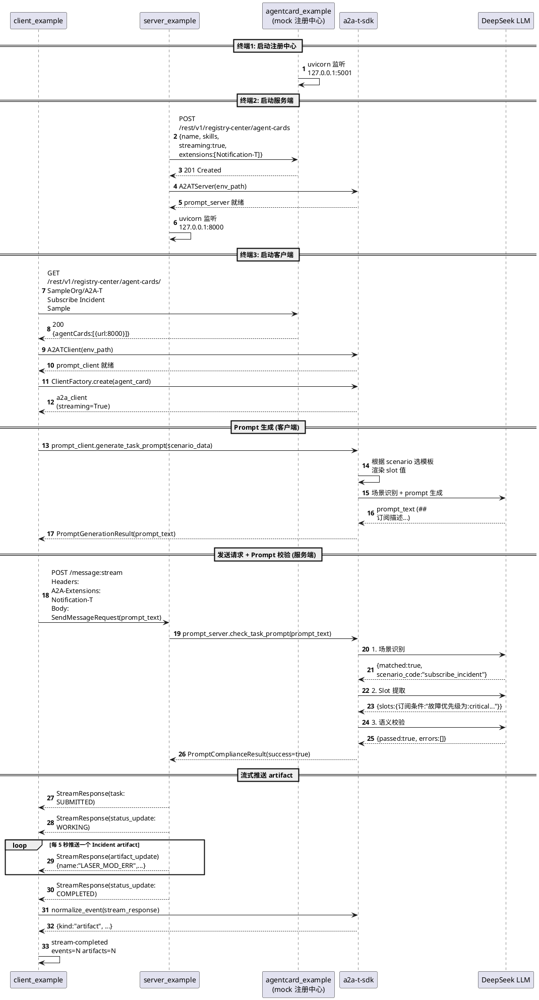

# 时序图：流式告警订阅端到端流程

## 流程说明

| 阶段 | 谁调 SDK | SDK 做什么 | LLM 调用次数 |
|------|---------|-----------|-------------|
| 启动 | client + server | A2ATClient / A2ATServer 初始化 | 0 |
| Prompt 生成 | 客户端 | 选模板 + 渲染 slot + 调 LLM 生成 | 1 |
| Prompt 校验 | 服务端 | 场景识别 → slot 提取 → 语义校验 | 3 |
| 流式推送 | 客户端 | normalize_event 归一化 stream 事件 | 0 |

## 关键点

- **SDK 是中间层**：client/server 不直接调 LLM，通过 SDK 的 A2ATClient/A2ATServer 间接调用
- **LLM 只在 prompt 阶段用**：推送 artifact 时不调 LLM
- **无协商**：客户端一次性提交完整输入，服务端校验通过直接推送
- **max_artifacts 控制停止**：CI 用固定值（5），端到端用 None（无限，Ctrl+C 停）
- **三层解耦**：client（发现 + 消费）→ server（注册 + 推送）→ registry（注册中心）
